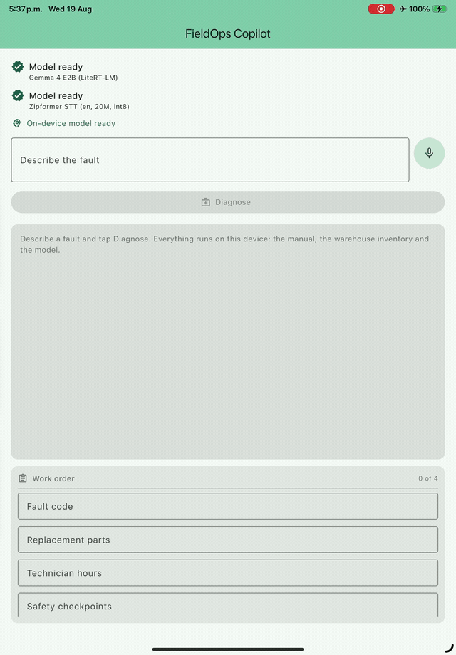
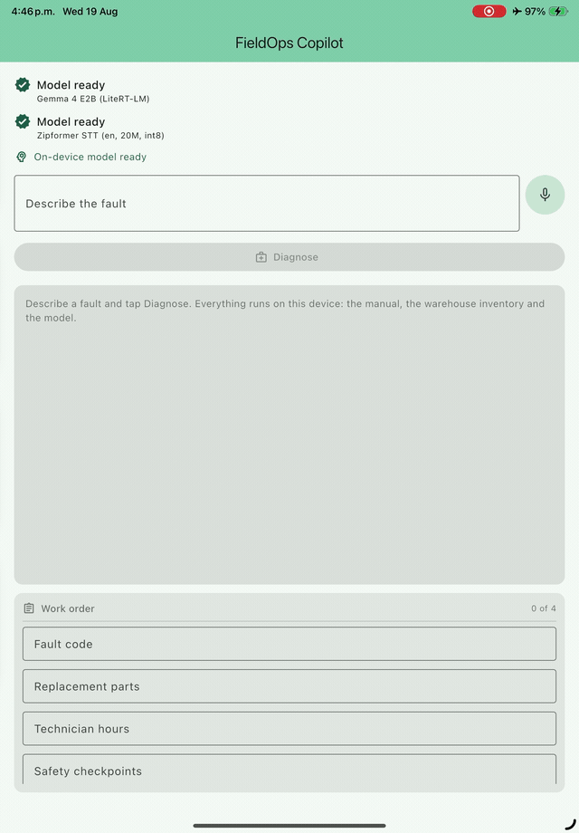

# FieldOps Copilot

An offline-first Flutter app for elevator field-service technicians. A technician
describes a fault - by voice or by typing - and an **on-device** language model
retrieves the relevant manual entry, checks the local warehouse, and fills in a
structured work order.

**Nothing leaves the device at inference time.** The manual, the parts inventory,
the 2.59GB language model and the speech recogniser all live locally, so the whole
diagnose-and-fill flow runs in airplane mode. The one thing that does need a
network is first-run provisioning: the model weights are fetched once, over a
pinned URL and verified against a pinned SHA-256, and never again.



*Recorded on an iPad in airplane mode - the ✈ in the status bar is the whole point.*

```
"Doors on car two cycle three times and throw an obstruction warning,
 and the belt squeals when they open. What part do I need and is it in stock?"

  → retrieved   Door Clutches & Belt Slippage (E-305)   ← from symptoms alone;
                                                          no fault code was typed
  → tool call   record_work_order_fields({fault_code, replacement_parts})
                → the work-order panel fills, live
  → tool call   get_local_parts_inventory("BELT-330-DRV")
                → 0 units - Aisle 1, Shelf C
  → answer      "BELT-330-DRV is currently out of stock (0 units in stock
                 at Aisle 1, Shelf C)"
```

The last line is the one worth watching. A grounded tool result is easy; a model
whose *prose* then agrees with it - rather than confidently inventing a quantity
next to it - is the thing this architecture exists to get right.

Two fields stay empty because the technician never mentioned hours or safety
checks, and the panel says so rather than guessing. The warning above them is
also real: on this run the model sent two values under field names the form does
not have, and reporting that is deliberate - see design decision 3.

Verified on real hardware - an iPad Air M4 (iOS 26.5) for the inference and
frame-budget measurements and the speech-to-text runs, an iPad Pro 11 (iOS 17.5)
for the voice and work-order runs. Most measured figures in the deep dives name the
device they came from; where one does not, it is because the device was not
recorded at the time, not because it is an average. The domain is fictional; the
engineering is not.

## Status

| Capability | State |
|---|---|
| Encrypted local database, offline retrieval, first-launch seeding | ✅ shipped |
| Model provisioning - SHA-256 pinned, staged, atomic | ✅ shipped |
| On-device LLM (Gemma 4 E2B / LiteRT-LM) with native function calling | ✅ shipped |
| Agent loop, tool registry, defensive call guard | ✅ shipped |
| Microphone capture + on-device speech-to-text | ✅ shipped |
| Voice → inquiry → agent → auto-filled work order | ✅ shipped |

1177 host tests, 7 golden transcript snapshots, 9 device integration test files.

## Architecture

MVVMC, with **every device capability behind a Dart interface**. That single rule
is what makes an app built around a 2.59GB model and a native recogniser testable
on a laptop with neither installed.

```
┌─ views/ ────────────────┐   Flutter widgets. One screen.
│  diagnose_screen.dart   │
└───────────┬─────────────┘
            │ Riverpod
┌───────────▼─────────────┐   State the screen renders. No plugin types.
│  viewmodels/            │   field_job · dictation · work_order_form
└───────────┬─────────────┘
┌───────────▼─────────────┐   The orchestration. Pure Dart, fully testable.
│  services/ai/           │   agent_loop · tool_registry · tool_call_guard
│  services/rag/          │   retrieval_router · prompt_compiler
└───────────┬─────────────┘
┌───────────▼─────────────┐   The interfaces: LlmEngine, SttEngine,
│  engines/               │   InferenceHost, SttHost
└─────┬──────────────┬────┘
      │              │
┌─────▼─────┐  ┌─────▼──────────┐   The only files that import a native
│ impl/     │  │ fakes/         │   plugin - one per capability, each
│ (device)  │  │ (host tests)   │   on its own isolate.
└───────────┘  └────────────────┘
```

Both native runtimes run on **dedicated background isolates**. That is not
defensive habit: `flutter_gemma`'s and `sherpa_onnx`'s Dart APIs are synchronous
blocking FFI, so a decode step on the UI isolate is a dropped frame, measured.

## Six design decisions, and what each cost

### 1 · A fake engine must be unreachable in production, not merely unused

Every capability has a deterministic fake so the host suite can run without a
model. The obvious wiring - fall back to the fake when no weights are installed —
produces something worse than a broken app: one that **answers fluently on a
device where the model never ran**, indistinguishable from a working app in a
screen recording.

So the production graph never falls back. Absent weights resolve to `null` and the
UI says so. A test (`no_fake_in_production_test.dart`) walks the resolved type
system to prove no production path reaches a fake - it is a test about the
*shape of the wiring*, because a convention nobody checks is a convention that
breaks.

**Cost:** every screen must handle a `null` engine. Worth it - that is also the
first-launch state.

### 2 · Structured output goes through the tool registry, not through the prose

The model fills the work order by **calling a tool**, not by emitting a JSON blob
the app scrapes out of its answer. The schema then drives constrained decoding,
the malformed-call guard already covers it, the agent loop already feeds refusals
back, and the exchange lands in the golden snapshots. A scraped blob has none of
that and needs a brace scanner nobody wants to own.



A second run, where the technician reports finished work instead of asking a
question. Four fields land at once - and **Technician hours reads `1.5`**, which
nothing asked for: the schema says the field exists and the model converted *"an
hour and a half"* on its own. Every field carries the agent-origin marker, so the
technician can see what they did not type.

→ [Agent tools](docs/agent-tools.md) · [The tool-call guard](docs/tool-call-guard.md)

### 3 · The technician outranks the agent

A field the technician typed is **never** overwritten. The agent's value parks
beside it as a suggestion they can take or dismiss; typing during dictation takes
the field *and* stops the microphone. A refused field update is a **successful**
tool call - reporting it as a failure would tell the model its whole call was
rejected when most of it landed.

→ [Voice input and the work order](docs/voice-and-work-order.md)

### 4 · Weights that do not verify do not run

Every model file carries a committed SHA-256 pin. Downloads are staged in a
`.part` directory and renamed into place only after **every** file in the set
verifies. A truncated encoder does not fail cleanly - it transcribes noise,
which reaches a technician as a confident sentence.

**Cost:** the URL and hash are build inputs (`--dart-define`), not constants,
because hard-coding either would commit a guess about a file this repository has
never downloaded.

→ [Model provisioning](docs/model-provisioning.md)

### 5 · The prompt is snapshotted, because a prompt is code

Seven golden scenarios pin the whole loop - compiled prompt, tool calls, payloads,
final transcript - and run on every CI push. A prompt edit that changes model
behaviour fails a test rather than a demo.

This paid out immediately. When a second tool was registered, a sentence saying
*"do not call any tool"* silently changed meaning from "don't invent a part
number" to "and don't fill in the work order either" - on the one path where the
technician's words are the only source of work-order data.

→ [Golden transcripts](docs/golden-transcripts.md)

### 6 · A tool the app depends on is named in the preamble, not just its schema

Found on the device, not in review. Given a four-field inquiry, Gemma 4 E2B called
the inventory tool, wrote a correct plan, left the work order empty, and closed
with *"if you… need to record the work order fields, please let me know."*

It knew the tool existed and treated it as an offer, because the preamble carried
a `MUST` for one tool and a description for the other. **A schema tells a model
what a tool is; the preamble tells it what the job requires.**

→ [Retrieval and the grounded prompt](docs/retrieval-and-prompt.md)

## What the device taught that the host suite could not

Four defects reached a device with a green host suite behind them. Three share one
cause, and it is the most useful thing in this repo:

> **A test double kinder than the hardware is a test that cannot fail.**

- **The first word of every dictation session was lost.** Not our capture - the
  recogniser mangles the opening of a stream. Two fixes reasoned from the code
  failed before a host reproduction found it in minutes, and then refuted three
  further hypotheses before they could become fixes three, four and five.
- **A `RangeError` killed dictation on the first frame.** Mic frames arrive as
  `Uint8List` views at whatever offset the platform allocator returned - 5, here.
  Every test double built frames with `Uint8List.fromList`, which is always
  aligned. 1158 tests were green while dictation died on every session.
- **A work order mixed two jobs**, showing one fault's hours under another's
  fault code, with the agent-origin marker on both.
- **The tool was never called** - decision 6 above.

→ [Speech to text](docs/speech-to-text.md) · [Microphone capture](docs/microphone-capture.md)

## Designed, not built

Everything above this line is code with tests behind it. This section is the
opposite and says so: these are the decisions a real fleet deployment forces, and
what the answer would be. They are here because the gap between a working demo and
a deployable product is mostly *these*, and a README that quietly omits them is
claiming to have closed it.

**Key management — the one that matters most.** The database cipher is real
(ChaCha20-Poly1305, KDF iterations pinned explicitly, verified in CI). The key
management is not: the passphrase is a `--dart-define`, and it falls back to a
constant literally named `demoDatabaseKey = 'fieldops-demo-key-not-a-secret'`.
That protects a stolen **file**; it does not protect a stolen **device**, because
anyone who can read the app bundle can read the key. The fleet answer is a random
key generated on first launch, held in the iOS Keychain or the Android Keystore
behind device-passcode protection, and never present in the binary — and it slots
in behind `databaseEncryptionKeyProvider` without touching a line above it. That
provider exists at that seam for this reason. The constant is named the way it is
for the same reason: hiding it behind something innocuous would satisfy the letter
and invert the intent.

**Credential delivery for model downloads.** Same shape, one layer out. The
provisioner takes its access token from a `--dart-define`, which means the token
is in the binary. The fleet answer is a short-lived signed URL issued per device
by a fetch service, which slots in behind `modelAccessTokenProvider` — again
without touching the provisioner, which already strips `Authorization` on a
cross-origin redirect so a signed URL to a CDN cannot leak the credential that
minted it.

**Thermal and battery governor.** A 2.59GB model generating tokens is the hottest
thing on the device, and a rugged handset in a machine room has no airflow. The
design is a telemetry interface over iOS `ProcessInfo.thermalState` and Android
`PowerManager.getThermalHeadroom()`, feeding a policy that enters a `throttled`
state and reduces the generation rate. The testable version asserts the *state
transition and its effect on rate*, never a magic millisecond constant — the same
rule the rest of this suite follows. This is where the measured 1.67GB RSS and the
frame-budget numbers stop being trivia and start being inputs.

**Offline sync queue and conflict resolution.** Work orders are written offline by
definition. The design is a write-ahead transaction log, a network-aware
background worker, and an explicit conflict policy — server-authoritative,
technician-priority, or a CRDT merge — chosen per field rather than per record,
because a technician's own labour hours and a dispatcher's assignment do not want
the same rule. Deliberately not built: it needs a server, and a server would be
the least interesting half of it.

**A second vertical, without a second app.** Elevators are one domain; the same
shape is HVAC, medical-device servicing, rail rolling stock. What retargeting would
actually cost is a property of where the domain lives, so it is worth being precise
rather than optimistic. The mechanism is clean: `engines/`, `services/inference/`,
`services/models/`, the agent loop, the tool-call guard, the tool registry and the
prompt compiler mention `E-102` and `BRK-990-XP` only in comments, as examples.
They would move to a new vertical unchanged. The domain itself sits in three
declared places — the seed asset, the tools registered with `ToolRegistry`, and the
preamble's description of the job.

Then there are the two places it leaked into code, which are the ones a second
vertical would actually find. `RetrievalRouter.faultCodePattern` is
`\b([A-Za-z]{1,2})[\s‐-―-]?(\d{2,4})\b` — one or two letters, an optional dash,
two to four digits. That is not "an identifier", it is *this* domain's identifier,
and a vertical numbering its faults `AC-7712-B` gets no code lookup at all while
every test still passes. And `WorkOrderField` is a Dart enum of four values, so a
different work order is a code change rather than configuration.

The enum has a sharper edge than the regex. The tool's JSON schema is generated
from it, which is right — but **the preamble spells the same four fields out in
prose**, and nothing asserts the two agree. Add a fifth field and it reaches the
model's tool schema automatically and its instructions not at all: design decision
6 over again, in the one place I had not thought to look for it. *A schema tells a
model what a tool is; the preamble tells it what the job requires.* The fleet
answer to all three is one vertical descriptor owning the field set, the identifier
pattern, the tool registrations and that preamble fragment together, bound by the
same agreement test the tool *names* already have. Written down rather than built
because one vertical cannot show whether the abstraction is the right one — two
can, and the second one is not free.

**Signed, append-only audit ledger.** "Which manual entry grounded this answer,
and when" is an OpenTelemetry span model over `FTS_Search` and `LLM_Inference`,
written to a signed append-only log and exported on reconnect. The observability
design is the transferable part; the signing is ordinary cryptography.

**Full OTA model pipeline.** The client half is built and proven on device —
download with progress, streaming SHA-256, atomic install, `doNotBackup`, and an
install receipt so readiness costs no re-hash. The rest is design: bucket layout,
device-capability-based model selection (a 4GB Android device gets Gemma 3 1B,
not E2B), staged rollout, and the App Store size constraints that decide whether
weights ship in the bundle at all.

**Wake-word activation.** Hands-free matters when both hands are inside a
controller cabinet. `sherpa_onnx` ships keyword spotting, so the model is not the
question; the power budget of always-on listening is, and on a shift-long battery
a hardware-button trigger may simply win.

**Ambient noise suppression.** A speech-enhancement pre-pass (GTCRN or DPDFNet,
both available in `sherpa_onnx`) between the microphone and the recogniser, traded
off against added latency — in a machine room the noise floor is the dominant
error source, well ahead of the model's own accuracy.

**One thing deliberately not designed away: FTS5 instead of embeddings.** The easy
vector path was one dependency away — `flutter_gemma` ships an embeddings package
and two RAG stores. SQLite FTS5 with a porter tokenizer plus a structured
exact-match column for fault codes was chosen anyway, because field-service
retrieval is dominated by deterministic identifiers (`E-102`, `BELT-330-DRV`) and
short symptom phrases, where lexical matching with stemming is near-perfect, fully
deterministic, testable with exact-match assertions, and adds no second model to
the memory and battery budget. The embedding path stays a documented extension
point behind the retrieval interface. The honest caveat is recorded in
[offline retrieval](docs/offline-retrieval.md): stop words match, so the
seed corpus would retrieve on almost any English sentence — a property of a
three-entry manual, and one that a real corpus and a real ranking threshold would
have to answer.

## Getting started

Requires the Flutter SDK (stable, Dart 3.12+). iOS 16.0+ or a 64-bit Android
device to run the on-device model.

⚠️ **Verified on iOS only.** Every measured figure in this repo came from an iPad.
The Android side is configured but **has never been run on hardware**: the
`RECORD_AUDIO` permission and the test that asserts it is declared, both
backup-exclusion rule files (`fullBackupContent` for API 30 and below,
`dataExtractionRules` for 31 and above), and all four `sherpa_onnx` ABIs are in
place, and [microphone capture](docs/microphone-capture.md) reasons about
`record_android`'s format coercion from the plugin's own source. But reasoning
about a platform is not running on it, and that is the distinction the rest of
this README is built on.

```bash
flutter pub get
flutter run
```

Without the model defines the app still runs: the banner reports that the model
source is not configured and **Diagnose** stays disabled - the correct behaviour,
not a degraded one. To run the real thing, accept the
[Gemma terms](https://ai.google.dev/gemma/terms) and pass:

```bash
flutter run -d <device> \
  --dart-define=FIELDOPS_MODEL_ID=gemma-4-e2b-it-int4 \
  --dart-define=FIELDOPS_MODEL_URI=<resolve URL for the file you licensed> \
  --dart-define=FIELDOPS_MODEL_SHA256=<its sha256>
```

The speech model needs no defines - its source and four hashes are committed.

Then type a fault (`cabin vibrating, E-102`) and tap **Diagnose**. For driving it
by hand, including what to say to the microphone and what each prompt should
produce, see **[device test scenarios](docs/device-test-scenarios.md)**.

## Testing

```bash
flutter test                                  # 1177 host tests
flutter test --tags live-stt --dart-define=…  # the real recogniser, on the host
flutter run integration_test/<file>.dart -d <device> --publish-port
```

Three things this project does that are worth stealing:

- **Golden transcripts** over the whole agent loop, not just unit assertions.
- **Targeted mutation testing**, in [`tools/mutation/`](tools/mutation). Every
  mutation is a concrete defect someone proposed; a fix whose own mutation survives
  has not been demonstrated, however good the argument. One "fix" in this repo was
  reverted on exactly that basis. Two sets ship, 59 rows, and they run from a
  clone: **57 killed, each by the specific test its row predicted, and the two
  survivors are the two the sets say up front will survive** — each for a reason
  written at the row rather than in a summary. `--verify` re-checks a set against
  the current tree in seconds, which is how a row keyed to a line a later fix had
  rewritten got caught instead of aborting an hour into a sweep. The guards are the
  part worth reading: every one exists because an earlier version of the harness
  reported a number that was wrong in a way its own output could not show. Six
  further slices were mutated with per-task scripts that are not published, and
  [that README](tools/mutation/README.md) says which counts are reproducible from a
  clone and which are still only reported.
- **A live-model suite on the host.** `sherpa_onnx` ships a macOS framework, so
  the real recogniser runs against real weights in CI-free opt-in tests - which is
  how the first-word defect was finally reproduced without a device.

→ [Testing](docs/testing.md)

## How this was built

Built with Claude Code, under review - each task its own PR, behind an adversarial
review pass and the mutation testing described above. The direction, the
architecture, the measurements and every decision documented on this page are
mine; the typing was assisted. Both facts are in the git history.

The interesting part of working this way is not the speed. It is that a reviewer
who proposes a concrete defect, and a harness that proves the suite would catch
it, become cheap enough to apply to **every** task rather than the scary ones —
which is where most of the findings on this page came from.

## Deep dives

Sixteen of them, which is more than anyone reads. **If you read two, read
[on-device inference](docs/on-device-inference.md) and [speech to
text](docs/speech-to-text.md).** The first is where the measured numbers miss this
project's own stated targets and say so — TTFT, resident memory, dropped frames.
The second is where a test double kinder than the hardware cost four defects, two
fixes reasoned from the code that both failed, and one revert. Everything else
here is reference, and the table says what each one answers.

Identifiers like `TC-STT-STRM-01` appear throughout these documents. They are this
project's own labels for the checks each task owed before it could be called done,
and [testing](docs/testing.md) maps every one to the file that owns it.

| | |
|---|---|
| [On-device inference](docs/on-device-inference.md) | Gemma 4 E2B over LiteRT-LM, isolates, native function calling, measured frame budgets |
| [The agent loop](docs/agent-loop.md) | Retrieval → prompt → tools → answer, the turn cap, three ways a run ends |
| [Agent tools](docs/agent-tools.md) | The `AgentTool` contract, typed arguments, refusal-as-success |
| [The tool-call guard](docs/tool-call-guard.md) | Calls spelled as prose, invented tools, repeated calls |
| [Retrieval and the grounded prompt](docs/retrieval-and-prompt.md) | Code lookup merged code-first with FTS, and prompt-injection defences |
| [Offline retrieval](docs/offline-retrieval.md) | FTS5, and the exact-match column a fault code needs |
| [Model provisioning](docs/model-provisioning.md) | Pinned hashes, atomic installs, staged transfers |
| [Data persistence & encryption](docs/data-persistence-and-encryption.md) | drift + SQLite3MultipleCiphers, ChaCha20-Poly1305 |
| [First-launch seeding](docs/first-launch-seeding.md) | Transactional seeding and revision checks |
| [Speech to text](docs/speech-to-text.md) | Streaming zipformer on an isolate, and the first-word defect |
| [Microphone capture](docs/microphone-capture.md) | 16 kHz mono PCM, bounded backlog, stall watchdog |
| [Voice input and the work order](docs/voice-and-work-order.md) | Mic → transcript → agent → form, and precedence |
| [The demo screen](docs/demo-screen.md) | One screen, and the frame measurements that shaped it |
| [Golden transcripts](docs/golden-transcripts.md) | Snapshotting the loop |
| [Testing](docs/testing.md) | Tiers, mutation testing, what a host test cannot tell you |
| [Device test scenarios](docs/device-test-scenarios.md) | Manual end-to-end checks, with expectations from the seed |

## Tech stack

| Concern | Choice |
|---|---|
| UI framework | Flutter (Material 3) |
| State management | Riverpod (`flutter_riverpod`) |
| Architecture | MVVMC with engine-abstraction interfaces |
| Local database | drift + SQLite3MultipleCiphers (`source: sqlite3mc`) |
| On-device LLM | Gemma 4 E2B (`.litertlm`) via `flutter_gemma` + `flutter_gemma_litertlm` (LiteRT-LM, `dart:ffi`) |
| On-device STT | streaming zipformer (en, 20M, int8) via `sherpa_onnx` (`dart:ffi`) |
| Audio capture | `record` (16-bit mono PCM) behind an `AudioInput` seam |
| Threading | One dedicated background isolate per native runtime, encoded message protocols |
| Model delivery | `dart:io` streaming download + `crypto` SHA-256 verify, no-backup storage |
| Testing | `flutter_test`, `integration_test`, golden snapshots, targeted mutation testing |
| CI | GitHub Actions |

## License

[Apache-2.0](LICENSE). The Gemma weights are not covered by it - their use is
governed by the [Gemma terms](https://ai.google.dev/gemma/terms).
